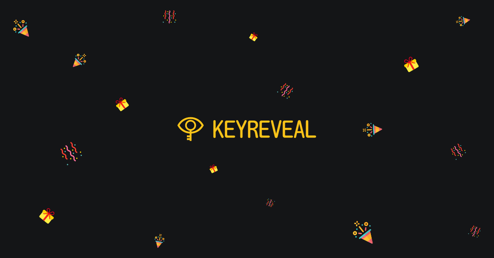

<br />
<div align="center">
  <a href="https://github.com/PhanDungTri/keyreveal">
    
  </a>

  <h2 align="center">KEYREVEAL</h2>

  <p align="center">
    You don't have to try all the keys
  </p>

  <a href="https://www.buymeacoffee.com/phandungtri">
    
  </a>
</div>

## About The Project

[](https://keyreveal.fun)

**Everyone :heart: giveaways and so do I :tada:**

I have taken part in many of them, most of them are on the social media. The host publicly post a bunch of product keys in a Facebook group or subreddit. These giveaways are first come, first served. Some kind people leave the message after claiming the keys so that latecomers will know which key is still available.

But there are also many people, I call them the ninjas, just sneak in, grab the keys then slip out without saying anything. This makes the latecomers have to try they keys one by one to realize that these keys are already **CLAIMED**. What an evil!

**KEYREVEAL** allow everyone to fully enjoy the fun of the giveaways by providing the way to keep track the statuses of the keys. So that people can know which key is already claimed and which one is still available. Besides, the host can make the giveaway public or private, or protect it with the password. And finally, **KEYREVEAL** is open source.

<p align="right">(<a href="#top">back to top</a>)</p>

## Getting Started

**KEYREVEAL** is a fullstack [Next.js](https://nextjs.org/) project and it's strongly typed with [TypeScript](https://www.typescriptlang.org/). I'm using [Mantine](https://mantine.dev/), "a fully featured React components library", to build the frontend and it's super cool. To deal with forms, I'm using [React Hook Form](https://react-hook-form.com/) and [Zod](https://github.com/colinhacks/zod/) for data validation. [Prisma](https://www.prisma.io/) is the best choice to work with the database.

### Prerequisites

- [Node.js](https://nodejs.org/) version >= 12.2.0
- Setup a RDBMS (MySQL, PostgreSQL, SQLite, etc.)

### Installation

1. Clone the repo

   ```sh
   git clone https://github.com/PhanDungTri/keyreveal.git
   ```

2. Install NPM packages

   ```sh
   npm install
   ```

3. Open the `.env.example` file, copy these below fields to `.env` file and replace the values with your own.

   ```sh
   DATABASE_URL=
   RECAPTCHA_SECRET_KEY=
   NEXT_PUBLIC_RECAPTCHA_SITE_KEY=
   ```

   _Note:_

   - _For [Google ReCAPTCHA](https://www.google.com/recaptcha/admin/create), you have to register your own site key and secret key._

4. Run the application

   ```sh
   npm run dev
   ```

<p align="right">(<a href="#top">back to top</a>)</p>

## Contributing

Contributions are what make the open source community such an amazing place to learn, inspire, and create. Any contributions you make are **greatly appreciated**.

If you have a suggestion that would make this better, please fork the repo and create a pull request. You can also simply open an issue with the tag "enhancement".

Don't forget to give the project a star! Thanks again!

1. Fork the Project
2. Create your Feature Branch (`git checkout -b feature/AmazingFeature`)
3. Commit your Changes (`git commit -m 'Add some AmazingFeature'`)
4. Push to the Branch (`git push origin feature/AmazingFeature`)
5. Open a Pull Request

<p align="right">(<a href="#top">back to top</a>)</p>

## License

Distributed under the MIT License. See `LICENSE.txt` for more information.

<p align="right">(<a href="#top">back to top</a>)</p>

## Contact

Phan Dung Tri - [LinkedIn](https://www.linkedin.com/in/dung-tri-phan-261b8b230/) - phandungtri99@gmail.com

<p align="right">(<a href="#top">back to top</a>)</p>
