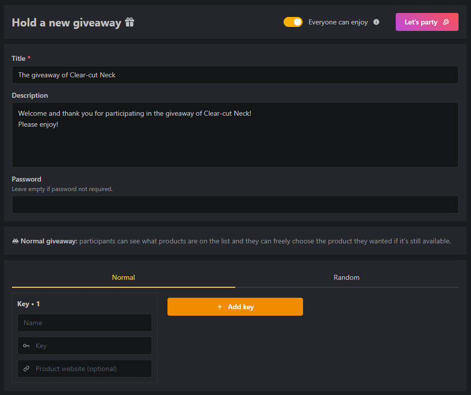
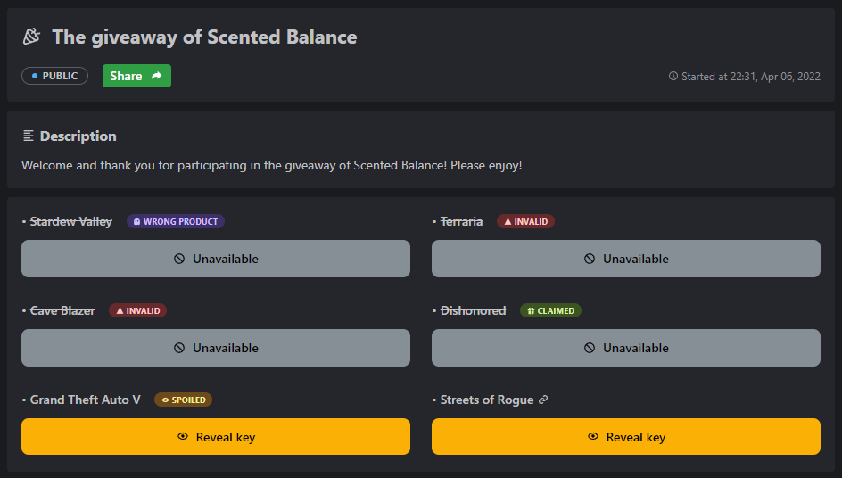
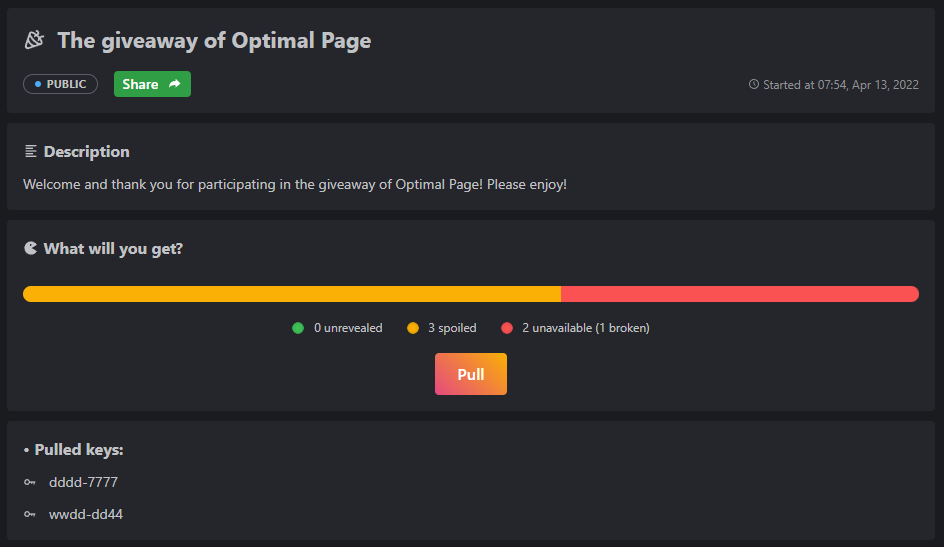

<br />
<div align="center">
  <a href="https://github.com/PhanDungTri/keyreveal">
    
  </a>

  <h2 align="center">KEYREVEAL</h2>

  <p align="center">
    You don't have to try all the keys
  </p>
</div>

## About The Project


**Everyone :heart: giveaways and so do I :tada:**

I've joined a lot of them, and most of them are on social media. The host put a bunch of product keys in a Facebook group or subreddit where everyone could see them. First come, first served is how these free things work. Kind people leave the message after taking the keys so that people who arrive later will know which key is still free.

But there are also a lot of people, whom I call "ninjas," who just sneak in, grab the keys, and leave without saying a word. This means that latecomers have to try each key one at a time to find out that it has already been taken. What a bad thing!


**KEYREVEAL** makes it easy for everyone to enjoy giveaways to the fullest by keeping track of the status of the keys. So that people can see which keys have already been taken and which ones are still open. Also, the host can choose whether the giveaway is open to the public or not, or they can use a password to protect it. Lastly, **KEYREVEAL** is free to use.

<p align="right">(<a href="#top">back to top</a>)</p>

## Getting Started

**KEYREVEAL** is a fullstack [Next.js](https://nextjs.org/) project and it's strongly typed with [TypeScript](https://www.typescriptlang.org/). I'm using [Mantine](https://mantine.dev/), "a fully featured React components library", to build the frontend and it's super cool. To deal with forms, I'm using [React Hook Form](https://react-hook-form.com/) and [Zod](https://github.com/colinhacks/zod/) for data validation. [Prisma](https://www.prisma.io/) is the best choice to work with the database.

### Prerequisites

- [Node.js](https://nodejs.org/) version >= 12.2.0
- Setup a RDBMS (MySQL, PostgreSQL, SQLite, etc.)

### Installation

1. Clone the repo

   ```sh
   git clone https://github.com/PhanDungTri/keyreveal.git
   ```

2. Install NPM packages

   ```sh
   npm install
   ```

3. Open the `.env.example` file, copy these below fields to `.env` file and replace the values with your own.

   ```sh
   DATABASE_URL=
   RECAPTCHA_SECRET_KEY=
   NEXT_PUBLIC_RECAPTCHA_SITE_KEY=
   ```

   _Note:_

   - _For [Google ReCAPTCHA](https://www.google.com/recaptcha/admin/create), you have to register your own site key and secret key._

4. Initialize database
   
   ```sh
   npx prisma db push
   ```

5. Run the application

   ```sh
   npm run dev
   ```

<p align="right">(<a href="#top">back to top</a>)</p>

## Screenshots







## Contributing

Contributions are what make the open source community such an amazing place to learn, inspire, and create. Any contributions you make are **greatly appreciated**.

If you have a suggestion that would make this better, please fork the repo and create a pull request. You can also simply open an issue with the tag "enhancement".

Don't forget to give the project a star! Thanks again!

1. Fork the Project
2. Create your Feature Branch (`git checkout -b feature/AmazingFeature`)
3. Commit your Changes (`git commit -m 'Add some AmazingFeature'`)
4. Push to the Branch (`git push origin feature/AmazingFeature`)
5. Open a Pull Request

<p align="right">(<a href="#top">back to top</a>)</p>

## License

Distributed under the MIT License. See `LICENSE.txt` for more information.

<p align="right">(<a href="#top">back to top</a>)</p>

## Contact

Phan Dung Tri - [LinkedIn](https://www.linkedin.com/in/dung-tri-phan-261b8b230/) - phandungtri99@gmail.com

<p align="right">(<a href="#top">back to top</a>)</p>
